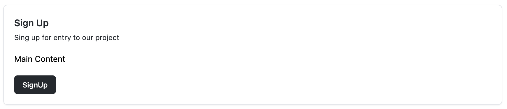

# Vortex UI for Vue3 + Tailwind

Vortex is a set of open source UI Components for Vue3 + TailwindCSS.

## Some Examples

__~button:__


__~card:__


__~checkbox:__


__~menu:__


__~avatar:__


... and more

## Download

VortexUI is available at [npm]().
```
~ Using npm
npm install vortex-ui
```

## Usage

```javascript
// for vue + js
<script setup>
import {Button} from 'vortex-ui';

const msg = ref('Hello World!')
</script>

<template>
  <h1>{{ msg }}</h1>
  <Button>Hello!!!</Button>
</template>
```

```typescript
// for vue + ts
<script setup lang="ts">
import {Button} from 'vortex-ui';

const msg = ref<string>('Hello World!')
</script>

<template>
  <h1>{{ msg }}</h1>
  <Button>Hello!!!</Button>
</template>
```
